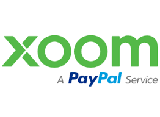

# The Other Xoom

### Group 6 Case Study: Xoom Corporation

_What is the background of your company? What do they do? Who are their competitors?_

Xoom Corporation, also Xoom, a PayPal Service is an electronic funds transfer or remittance provider that allows consumers to send money, pay bills and reload mobile phones from the United States and Canada to 131 countries. https://en.wikipedia.org/wiki/Xoom_Corporation

Competitors: TransferWise, Venmo, WorldRemit, Ria Money Transfer, Western Union

_How does this company use technology to their advantage? Why are they considered a FinTech company?_

    - desktop and mobile site
    - utilizes reloaded mobile phones for mone transfers
    - Verisign
    - Third-party TRUSTe Privacy Seal Protection

_Why is this company exemplary in the FinTech space? What are their strengths and weaknesses?_

Strengths:

    - utilize FinTech to ensure the security and legitimacy of transfers (prevents fraud, theft, money laundering)
    - In June 2010, Xoom was cited in a study by the Inter-American Dialogue of 79 remittance service providers as having the "highest consumer satisfaction ratings in transparency of the fee, transparency of the foreign exchange, and value".  Orozco, Manuel (10 June 2010). "A Scorecard in the Market for Money Transfers: Trends in Competition in Latin America and the Caribbean". Inter-American Dialogue. Archived from the original on July 28, 2011. Retrieved January 14, 2011.

_What is the prognosis for this company? Where do they expect to be in the future?_

    In March 2011, and in September 2012, Xoom was listed in the Wall Street Journal's annual "Next Big Thing List" list of the 50 most promising venture-backed companies. Debaise, Colleen (10 March 2011). "The Top 50 Venture-Backed Companies". Wall Street Journal. Retrieved March 10, 2011.   Zoran, Basich (27 March 2012). "Looking for the 'Next Big Thing'? Ranking the Top 50 Start-Ups". Wall Street Journal. Retrieved January 3, 2013.